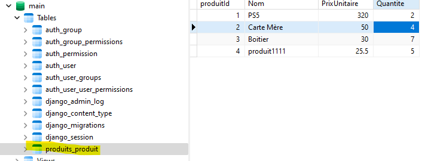
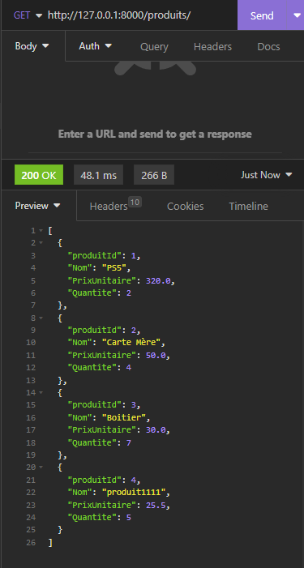
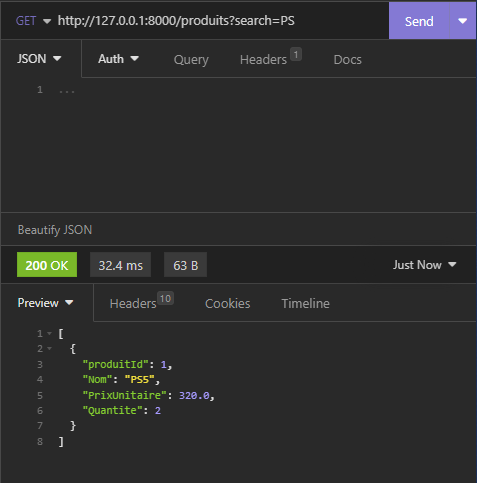
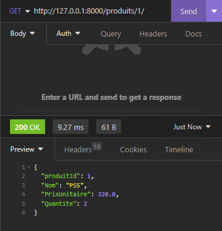
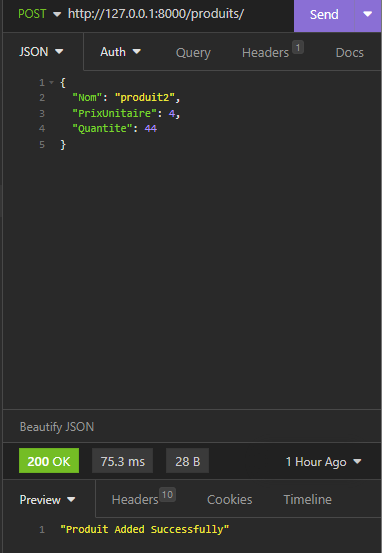
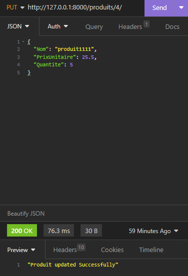
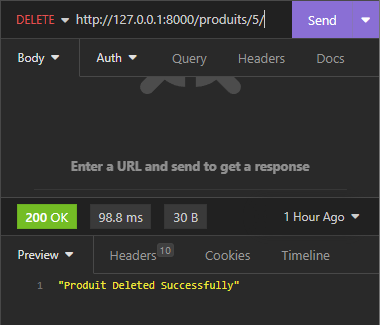
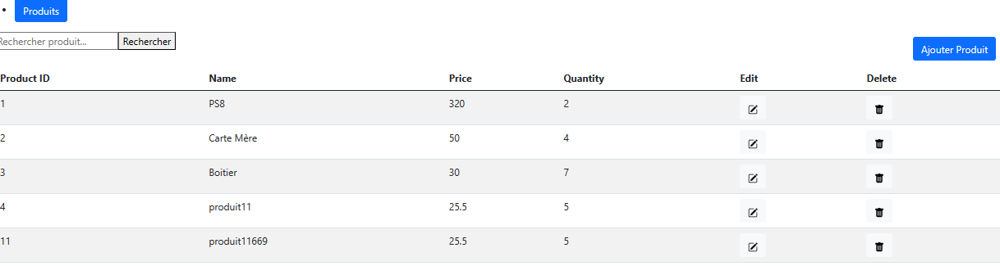
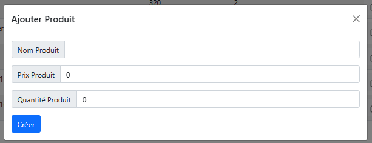

Développement back-end:

Pour développer le backend, nous devrons installer l'IDE Pycharm et le Framework Web Django, si vous ne souhaitez pas utiliser Pycharm, vous pouvez utiliser n'importe quel IDE de votre choix.

1) Ouvrez le terminal et installez les bibliothèques requises dans l'environnement virtuel:
pip install Django 
pip install djangorestframework
pip install django-cors-headers
2) a) Créez un nouveau projet Django:
django-admin startproject backend
b) La structure du projet devrait ressembler à ceci :
 
c) Ces fichiers sont :
•	Le répertoire racine externe backend/ est un conteneur pour votre projet, son nom n'a pas d'importance pour Django, vous pouvez le renommer en tout ce que vous voulez.
•	manage.py: Un utilitaire en ligne de commande qui vous permet d'interagir avec ce projet Django de différentes manières.
•	Le backend/répertoire interne est le package Python réel pour votre projet.
•	backend/__init__.py: Un fichier vide qui indique à Python que ce répertoire doit être considéré comme un package Python.
•	backend/settings.py: Paramètres/configuration pour ce projet Django.
•	 backend/urls.py: Les déclarations d'URL pour ce projet Django, une « table des matières » de votre site alimenté par Django.
•	 backend/asgi.py: Un point d'entrée pour les serveurs Web compatibles ASGI pour servir votre projet.
•	 backend/wsgi.py: Un point d'entrée pour les serveurs Web compatibles WSGI pour servir votre projet.
3) Maintenant que notre projet Django est créé. Nous pouvons démarrer le serveur de développement pour tester si le projet est initialisé avec succès. Exécutez les commandes ci-dessous pour démarrer le serveur de développement Django:
cd backend
python manage.py runserver
4)a) Créer une application pour les produits:

python manage.py startapp produits

b) Django créera les fichiers suivants dans le répertoire de l'application des étudiants :
 
c) Ces fichiers sont :
•	Le produits/migrations/répertoire contiendra le code pour la migration des modèles Django dans la base de données.
•	produits /__init__.py: Un fichier vide qui indique à Python que ce répertoire doit être considéré comme un package Python.
•	produits /admin.py : Tous les modèles d'application des produits seront enregistrés dans ce fichier afin qu'ils puissent être gérés à partir du panneau d'administration de Django.
•	produits /apps.py: Ce fichier contient la configuration de l'application des produits, par exemple le nom de l'application.
•	produits /models.py: Tous les modèles de base de données pour cette application seront créés dans ce fichier.
•	produits /tests.py : Tous les tests unitaires de cette application seront créés dans ce fichier.
•	produits /views.py : Les vues contiendront la logique de traitement des requêtes HTTP, par exemple GET, POST, PUT, DELETE, etc.
5) Créer un modèle produit:
Nous avons d'abord besoin d'un modèle pour stocker les informations sur les produits. Un modèle est converti en table de base de données lorsque nous appliquons des migrations. Dans notre produits/models.py fichier  , ajoutez le code ci-dessous pour créer le modèle étudiant :

from django.db import models 
# Create your models here.
class produit(models.Model):
     produitId = models.AutoField(primary_key=True)
     Nom = models.CharField(max_length=100)
     PrixUnitaire = models.FloatField() 
     Quantite = models.IntegerField()
6) Ensuite, nous devons appliquer des migrations pour créer la table produit dans la base de données. Django est livré avec une base de données SQLite par défaut.
Avant d'exécuter la migration, nous devrons ajouter l'application des produits dans le fichier settings.py. Ouvrez le fichier settings.py et ajoutez produits.Apps.ProduitsConfig au paramètre INSTALLED_APPS :

 

7) Exécutez maintenant cette commande pour générer un script de migration pour l'application des produits. Cela générera le script 0001_initial.py dans le produits/migrations dossier pour tous les modèles que vous avez définis à l'intérieur.

python manage.py makemigrations produit
8) Exécutez la commande ci-dessous pour examiner le SQL généré pour cette migration :

python manage.py sqlmigrate produit 0001
9) Exécutez maintenant migrate pour créer le modèle étudiant dans votre base de données :
python manage.py migrate 
10) Créer un sérialiseur étudiant:
Avant de créer notre vue Produit, nous devons créer un sérialiseur.Les sérialiseurs permettent de convertir des données complexes telles que des ensembles de requêtes et des instances de modèle en types de données Python natifs qui peuvent ensuite être facilement rendus dans JSON, XML ou d'autres types de contenu. Les sérialiseurs fournissent également la désérialisation, permettant aux données analysées d'être reconverties en types complexes, après avoir d'abord validé les données entrantes.
Créer un fichier nommé serializers.py dans le répertoire produits. Ouvrez produits/serializers.py et ajoutez le code ci-dessous dans ce fichier :
 
11) Créer une vue produit
Nous pouvons maintenant écrire des méthodes HTTP pour GET, POST, PUT et DELETE pour effectuer une opération CRUD sur notre modèle étudiant.
Ouvrez produits/views.py et ajoutez le code ci-dessous dans ce fichier pour créer un nouvel produit dans la table des étudiants.

 
12) Pour appeler la vue, nous devons la mapper à une URL — et pour cela nous avons besoin d'une URLconf.
Créez un fichier nommé urls.py dans le répertoire produits.
13) Ouvrez produits/ urls.py et ajoutez le code ci-dessous dans ce fichier:

 
14) Cette URL est désormais disponible pour notre application produits. Mais nous ne pouvons toujours pas y accéder depuis le navigateur. Pour le rendre accessible à Django, nous devrons inclure produits/urls.py dans l'URLconf racine.
Ouvrir backend/urls.py et inclure students.urls dans urlpatterns  liste:
 
15) Il faut ajouter l'application django-rest-framework dans nos INSTALLED_APPS. Ouvrez backend/settings.py et incluez les corsheaders et les applications rest_framework dans INSTALLED_APPS :

 
16) Méthodes GET, PUT et DELETE:
a) GET:
 

b) PUT:
 
d) DELETE:
 

## Base de donnèes: (SqLite)

## APIs:

- GET :

- SEARCH :

- GET ONE PRODUCT:

- ADD :

- PUT :

- DELETE

# Front End (React.Js)
# Fichiers:
>> Le fichier __Variables.js__ contient les uri comme l'url de l'api backend.

>> __App.js__ utilise le framework `react-router-dom` pour gérer les routes de l'application. L'application affiche un titre, une barre de navigation et un composant `Product` qui est rendu lorsque l'utilisateur accède à la route `/home`.
Le composant `App` est défini comme une fonction qui renvoie le JSX de l'application. Il utilise le composant `BrowserRouter` pour envelopper toute l'application et le composant `Routes` pour définir les routes de l'application.
La barre de navigation est créée avec le composant `NavLink` de `react-router-dom`. Il permet de créer des liens vers différentes routes de l'application.
Le composant `Product` est importé depuis le fichier `Product.js` et est défini comme une fonction qui renvoie le JSX du composant. Le composant `Product` affiche une liste de produits et permet à l'utilisateur de les ajouter, de les modifier et de les supprimer.
Le CSS est importé depuis le fichier `App.css` et est utilisé pour styliser l'application..

>> Le dossier __Pages__ contient les page __Home__ et __Produit__

- Create react app: `npx create-react-app my-app`
- Installer les modules: `npm i`
- Run server : `npm start`

### Interface:

### Modèle Ajout/Modifier Produit:

